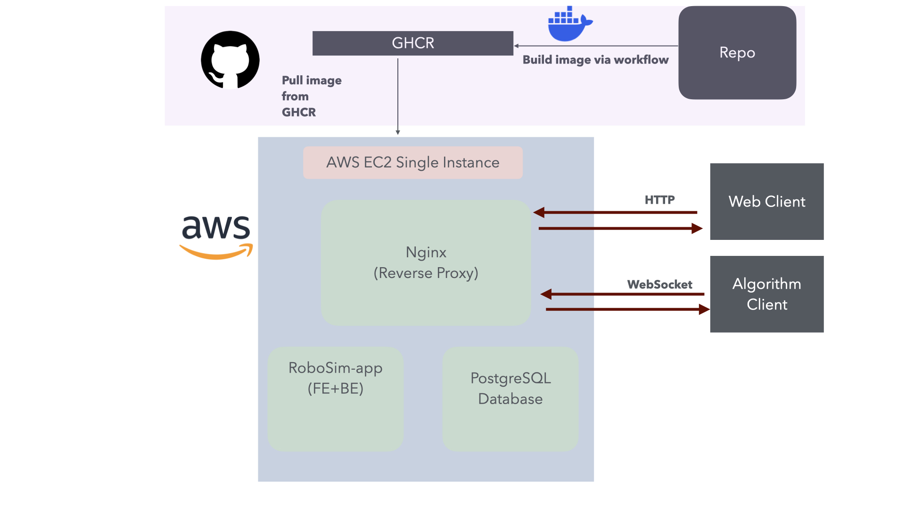
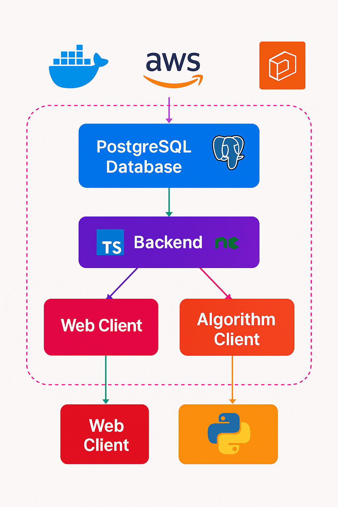

# 2025-RoboSim


## Context

RoboSim acts as a simulation where self-moving, self-stacking robotic boxes can organise autonomously. Our platform serves as a workspace for algorithm designers to write and test their own algorithms. By generating statistics and performance metrics for every simulation run, RoboSim allows developers to benchmark exactly how efficiently their algorithms coordinate the boxes, whether they are controlling the original MIT M-Blocks or the newer vertical climbing model, to reach their target locations.

#### If you are a new developer on Robosim, read [this document](documents/Handover.md) for a more detailed explanation

## Project Overview

This year, our team is working on a broad set of improvements across the entire RoboSim project. On the technical side, we are migrating to a new database to improve a critical issue with deployment and are expanding the testing and benchmarking to provide more detailed performance metrics. A key focus is designing and implementing new pathfinding algorithms that allow the Type 2 boxes to move to target locations in the warehouse as efficiently as possible. We are also adding many new features to the website interface, aiming to improve the simulation's usability.

This is the fourth iteration of the RoboSim project; see [2024-RoboSim](https://github.com/spe-uob/2024-RoboSim), [2023-RoboSim](https://github.com/spe-uob/2023-RoboSim)
and [2022-RoboSim](https://github.com/spe-uob/2022-RoboSim).

## Project Structure

```
├── algorithm-client/
├── documents/     
├── infrastructure/
├── server/
├── tests/
├── web-client/
├── docker-compose.yml
├── package-lock.json
├── package.json
└── README.md
```

For a more detailed explanation of our project structure, look at our [Handover](documents/Handover.md) document. 

`algorithm-client/` contains both algorithms and the client which runs them.

`documents/` contains any important documents about our project.

`infrastructure/` contains our Dockerfile and Docker Compose files for deployment.

`server/` contains files related to the database and its handling.

`tests/` contains scenario files and config for the playwright tests. 

`web-client/` consists of frontend code for the website, as well as backend functionality such as running replays of algorithms.


## Objectives

- [x] Write a fully functioning greedy Type 2 algorithm.
- [x] Migrate a new and improved database, which will store all the algorithm runs and scenarios more efficiently.
- [x] Overhaul the playground to fix bugs, reduce clutter, and add new features.
- [x] Create more controls during replay viewing of algorithms.
- [x] Improve the system's homepage.
- [x] Introduce entry/exit zones for new algorithms in the warehouse.
- [x] Make a new leaderboard page which displays more analytics and shows currently running algorithms.

      
## Stakeholders

### Warehouse Managers
- **Who They Are:** People who are responsible for handling operations within the warehouse.
- **Their Involvement:** RoboSim allows them to determine the best ways to store and retrieve goods to minimise management overheads.

### Algorithm Designers
- **Who They Are:** People who work in Algorithm Design, specialising in efficiency and optimisation.
- **Their Involvement:** RoboSim allows them to develop, improve and optimise 3D routing algorithms with its usable API and its own benchmark routing algorithm.

### Our Client
- **Who They Are:** The person we're working on this project for.
- **Their Involvement:** Passionate about this project and providing us with ideas and support.

### People Working On The Project In The Future
- **Who They Are:** People who wish to enhance this project further.
- **Their Involvement:** We expect this project may be run again for SEP, so we want to make our work as easy to understand and pass on in the future.


## User Stories

- As a Warehouse Manager, I want to optimise storage and retrieval of goods, so that I can increase operational efficiency to reduce the overheads of inventory management.
- As an Algorithm Designer, I want to develop and benchmark routing algorithms with an intuitive API, so that I can streamline testing and optimisation of robot navigation in 3D space.
- As the client, I want to explore the potential that RoboSim has to offer.
- As a person working on this project in the future, I want support with understanding the existing codebase and project.

## Project Architecture


- The current architecture follows a single-instance design, offering a simple and low-maintenance setup
- In our AWS server, we have a single container that includes our apps, containing frontend, backend and our PostgreSQL database.
- Our AWS server has Nginx that supports reverse proxy.
- PostgreSQL database and app are stored in independent containers.

## Tech Stack


- **Web Client**: Written in HTML, CSS and TypeScript, using ThreeJS to render
  boxes. Built using Vite.
- **Server**: Written in TypeScript and run using NodeJS. Consists of a web server
  for the website (written using Express), and a WebSocket server for Algorithm
  Clients.
- **Database**: Using PostgreSQL, which has its own container on an AWS server. When running locally, it is in a Docker container.
- **Algorithm Client**: A Python package that anyone can use to build their own
  algorithms and send them to the server. Distributed as a wheel or source
  distribution available to download from its [documentation
  website](https://cautious-adventure-plj4wz9.pages.github.io/).

## Setup Instructions

We have a document [here](documents/setup-instructions.md) which explains the entire process of setting up the project! 

## Team Members

| Members         | Email                                                        |
| --------------- | ------------------------------------------------------------ |
| Freya Donnelly  | [xn24689@bristol.ac.uk](mailto:xn24689@bristol.ac.uk)        |
| Cassie Lambert  | [bq24707@bristol.ac.uk](mailto:bq24707@bristol.ac.uk)        |
| Raymond Kellner | [raymond.k.2024@bristol.ac.uk](mailto:raymond.k.2024@bristol.ac.uk) |
| Mincheol Shin   | [og21974@bristol.ac.uk](mailto:og21974@bristol.ac.uk) |
| Ziyang Wang     | [rl24988@bristol.ac.uk](mailto:rl24988@bristol.ac.uk) |

| Week                        | Project Manager |
| --------------------------- | --------------- |
| Week 13 - Testing Day       | Cassie Lambert  |
| Testing Day - Beta Release  | Raymond Kellner |
| Beta Release - Viva         | Ziyang Wang     |
| Viva - Week 21              | Mincheol Shin   |
| Week 21 - Week 23           | Freya Donnelly  |
