# The Fill-Remove Algorithm

A mostly-complete algorithm on Type 1 boxes.

## Running the algorithm

First make sure the server is running, and that you have installed
`algorithm-client`. To install the algorithm, run:

```bash
pip install -e .
```

To then start the algorithm, run:

```bash
fill-remove
```

## How it works

The main part of the algorithm simply aims to move a single box from a source
location to a target location. This is done in two steps.

Throughout this explanation, we often refer to "stacks", meaning all the boxes
with a particular `(x, z)` coordinate in the warehouse. Since boxes cannot
float in midair, these boxes form a stack.

### Finding a path

The algorithm first tries to find a path for the box to take. Boxes can move in
all four directions, and can move diagonally upwards and downwards. Of course,
in some scenarios, there is no path that works with the current arrangement of
boxes (see, for example, the below diagram in 2D, where the red box is the
source location and the green box is the target location).

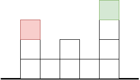

To solve this, the algorithm allows the box to move into any space, so long as
the space is in the bounds of the warehouse. For each square visited by the
path, the algorithm measures the difference between the Y coordinate of the
path and the height of the boxes in the warehouse. The algorithm attempts to
minimise the sum of these differences (along with the number of steps in the
path).

For the example above, one optimum path would be:

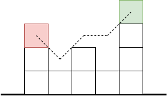

Here's a more complicated example:

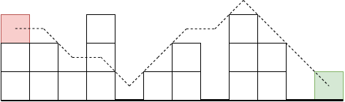

The algorithm finds an optimum path of the kind specified above using
Dijkstra's algorithm, where:

- Each space in the bounds of the warehouse is a node.
- Each node is connected to every space it can reach in a single move (i.e.
  each edge represents a move).
- Every edge has weight 1.
- Suppose a node has coordinates `(x, y, z)`, and let `h` be the number of
  boxes in the warehouse with the same `x` and `z` coordinates as our node
  (we call this the "stack height"). Then the node has weight `|y - h|`.

### Filling and removing boxes

Once we have a path, we need a method of moving the other boxes in the
warehouse to ensure that the path is valid. More precisely, at each step of
the path, we need to:

1. If there is a box in the way of the step, then we need to remove that box
   (and all boxes above it).
2. If the step requires the box to move to a space which is not supported
   below, then that space (and any empty spaces below it) need to be filled by
   another box in the warehouse.

This motivates the definition of two mutually recursive subroutines:
`fill_box()` and `remove_box()`.

#### Defining the subroutines in two dimensions

Suppose, in the diagram below, that we want to fill the dotted space. The most
obvious choice is the box highlighted in blue, since it can move into the space
with a single move.

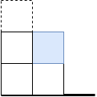

However, if that box is not there, then the problem is more difficult. In fact,
in the below scenario we must fill the blue dotted space, and then use the box
in the space we have just filled.

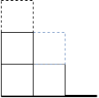

If the adjacent stack of boxes is lower still, then we keep adding a box to
the stack until it is high enough. In the below example, we have to fill both
spaces marked with blue dotted lines before we can fill the black dotted space.

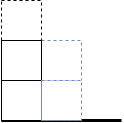

Similarly, if the adjacent stack is too high for the top box to be moved to
fill the target, we remove boxes from the top of the stack. In the below
example, we must remove the two boxes highlighted in red, and then move the
box highlighted in blue into the empty space.

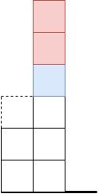

Removing boxes is a similar procedure. Suppose we want to remove the box below
highlighted in red. Then we can simply move it onto the adjacent stack.

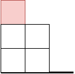

However, if the stack is too tall or too short, then we must repeatedly remove
or fill boxes until the stack is the required height.

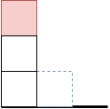

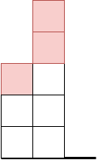

Now, `fill_box()` and `remove_box()` can be defined as mutually recursive
functions, where the base case occurs in the "trivial" cases above, where
filling and removing can be done in a single move

#### Expanding to three dimensions

In reality, if we want to fill or remove a box, we have up to four adjacent
stacks to use, rather than just one. Given a fill/remove operation between two
specific stacks, we can calculate the number of subsequent fill/remove
operations by comparing the heights of the two stacks. The algorithm chooses
an adjacent stack that minimises this metric.

Consider the 2D example below, where we want to fill the black dotted space.
The algorithm will then attempt to fill the blue dotted space. However, its
possible for our recursive algorithm to use the box marked in yellow to do
this.

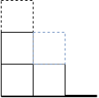

To solve this, the algorithm keeps track of the stacks that we have already
visited, and never visits the same stack twice. This also means that the
algorithm will terminate if it can't find a solution.

The algorithm also implements backtracking, where if it needs to fill or remove
a specific box, it will exhaust all adjacent stacks until it finds a solution,
rather than terminating if the best stack fails.

### Putting the parts together

The final algorithm (roughly) works as follows, given a source location and
a target location:

- Find a path from the source location to the target.
- Remove all boxes above the source.
- For each step in the path:
  - Either fill or remove boxes until the stack at the end location of the step
    is at the right height.
  - Move the source box to the end location of the step.

### Expanding to multiple boxes and simultaneous moves

While the algorithm is designed to work on a single box, it works when a
scenario requires multiple boxes to move, simply by moving boxes one at a time.

The algorithm also includes an optimisation that executes certain moves
simultaneously if it determines that they can be executed at the same time.

## Possible improvements

While the algorithm completes a surprising variety of scenarios, it is
(unsurprisingly) unable to complete every solvable scenario. The main
bottleneck there is the fact that the path, once found, is fixed, although it
is unclear how this could be changed. There are also a few opportunities for
speed improvements. It's worth noting that the bottleneck is currently the
speed of move execution, meaning that improving the speed at which moves are
computed will have little to no benefit.

### Improving the path-finding algorithm

Currently, the path-finding algorithm does not take very long to complete on
all the default scenarios. However, it's possible that given a scenario that
is a lot bigger, or one that has different properties than the generated
default scenarios (e.g. where the target location is not on top of an existing
stack), this step will take longer to run.

A simple optimisation would be to use the A\* algorithm, or another
heuristic-based algorithm, instead of Dijkstra's.

Additionally, adjusting the costs of nodes and edges may provide some benefit.

### Improving the filling and removal of boxes

Currently, `fill_box()` and `remove_box()` work a little like a depth-first
search. However, an algorithm that works more like a breadth-first search
would be able to find a way to fill or remove a given box that is guaranteed
to be minimal in terms of moves.

A good first step towards achieving this would be to rewrite `fill_box()` and
`remove_box()` to be iterative rather than recursive.

### Improving simultaneous move execution

The algorithm that allows moves to be executed simultaneously assumes that
the moves computed by the algorithm must be executed in order, which is not
always true. The algorithm has a large potential for different steps to be
executed at the same time.

### Improving performance on multiple boxes

The way the algorithm handles moving multiple boxes is not the best. That
being said, the problem of moving multiple boxes (often called Multi-Agent
Path-finding) is _hard_.
