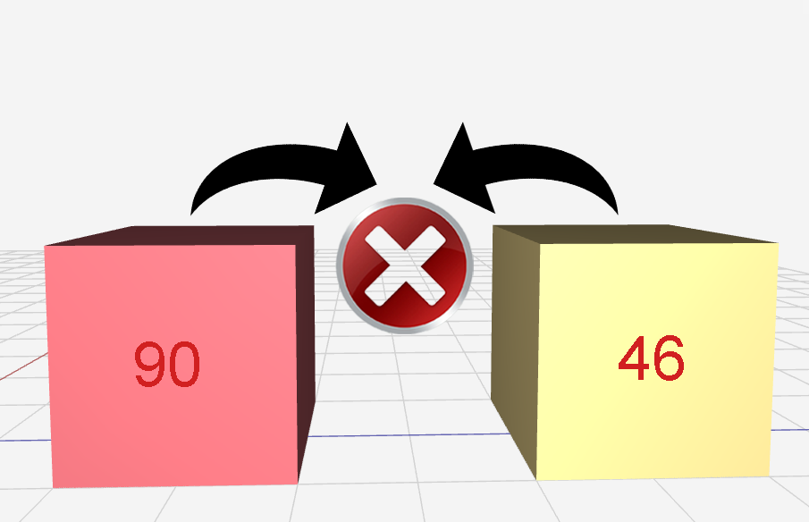
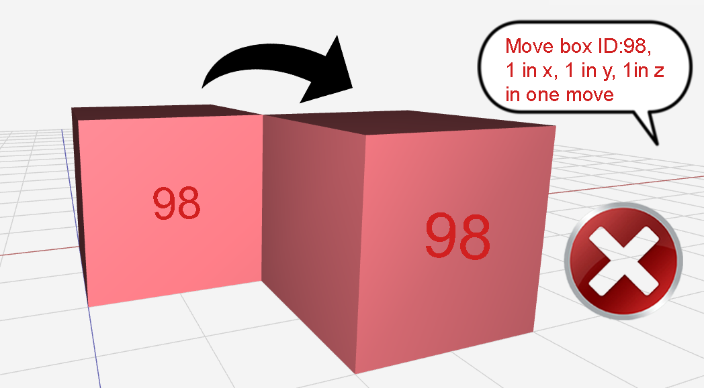
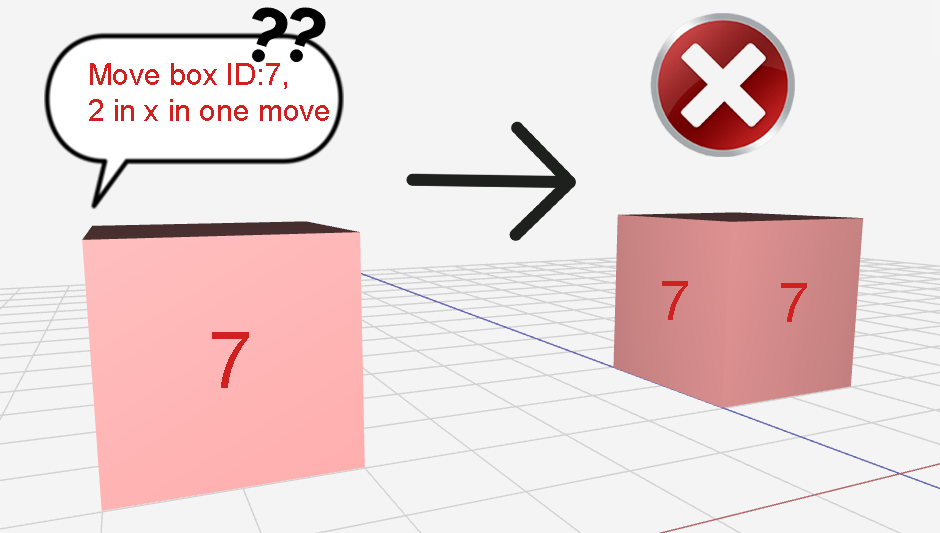
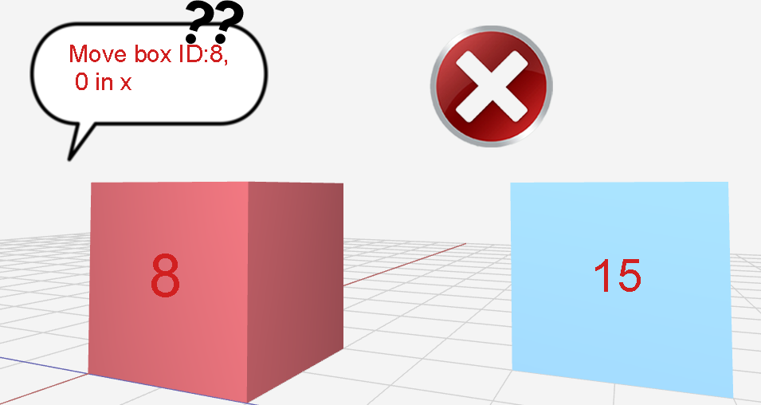
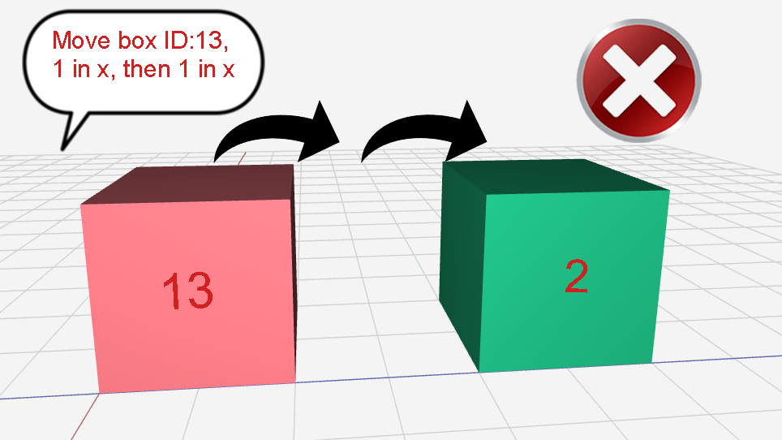
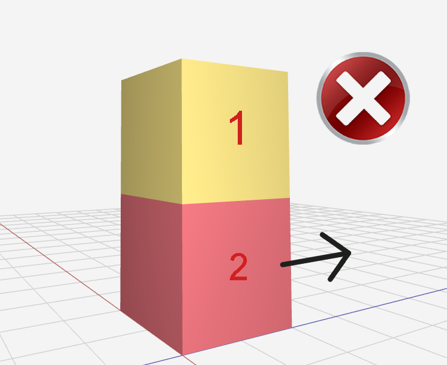

# Validator System
  ## What is the validator system?
  The validator system is a built in set of rules which is imposed on your algorithim's every move. Don't worry, the rules aren't too restrictive; but they're just there to make sure your algorithm doesn't defy at least TOO MANY physics of the real world, as well as doesn't needlessly waste resources.

  ### Please find below the mentioned rules and diagrams corresponding to each one:

  - #### Boxes Should Not Be Floating:

  

  Unfortunately, as tempting as may be to have a box floating around, the physical limitations of gravity just wouldn't allow that. Your box just going up by one in the y-axis isn't the only way this can happen, find in the image below another imposed rule to prevent boxes flying. 

  

  - #### Shouldn't Be Able to Send a Move to a Nonexistent Box:

  

  Self-explanatory really, if you try to send a move to a box ID that simply doesn't exist, your algorithm will fail. Don't waste resources!

  - #### Boxes Moving to Same Co-ordinate in Next Move:

  

  Your algorithm is trying to take the boxes from point A to point B seamlessly. We don't really think boxes going ahead and bouncing off each other is exactly seamless, so keep track of your boxes when developing your algorithm!

  - #### No Diagonal Moves:

  

  Feel free to have your box take a diagonal course of moves, but that shouldn't be possible in one move. If you want to move your box diagonally for example, send two individual moves, 1 in x first, then 1 in z. If you do both simultaneously, your algorithm will fail.

  - #### Moving More Than One Space at a Time:

  

  Yet again self-explanatory, if you want your box to move 2 in the x-axis. Send it as (once again) two individual moves, 1 in x, then again 1 in x.

  - #### Can't Be Sending Lines That Do Nothing!:

  

  If your algorithm tells a box explicitly to just not move. You're wasting resources! If you don't want a box to do anything, do the same relative to the box, nothing! 

  - #### Can't Have Boxes Phasing Through the Ceilings and Walls:

  

  While it's pretty cool when The Flash does it, your boxes shouldn't be able to go through the walls, the floor, or the ceiling. The environment you're given will have a limited space (or warehouse) and in physical reality, the boxes won't be able to just go through the walls or under the ground.

  - #### Can't Move Box to an Already Occupied Spot:

  

  The image clarifies it plenty, a box can't move into the position of another box. If you want Box A to go into position X, but position X is occupies by Box B; you'll have to vacate position X by moving Box B elsewhere.

  - #### Can't Move a Box if Another is on Top of it:

  
  
  If a box already has a box on top of it, you can't just move it as it has restricted movement due to the space taken by the box on top of it. Furthermore, even if that move were possible, you'd leave the box above it floating, which we've established just isn't how gravity works.
