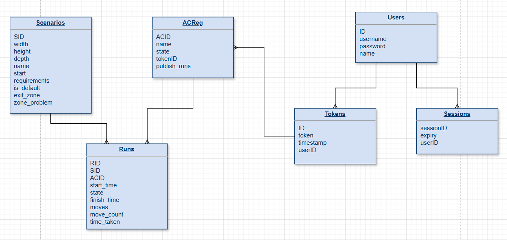

# Robosim 2025 Handover

## Contents

- [Introduction](#introduction)
- [Setup](#setup)
- [Structure](#structure)
- [Database Structure](#database-structure)
- [Tech Stack](#tech-stack)
- [Suggestions on where to start](#suggestions)
- [Deployment help](#deployment-help)

## Introduction

If you're a new developer on this project, welcome! This guide will give an overview of Robosim and explain various aspects of our project as it currently is. 

## Setup

After cloning the repository, simply follow the instructions in [this document](setup-instructions.md)! There are quite a few steps, but I hope it's clear how to follow them. Robosim should then be up and running on your device locally!

## Structure

The main folders in our project are:

```
├── algorithm-client/
├── documents/     
├── infrastructure/
├── server/
├── tests/
├── web-client/
├── docker-compose.yml
├── package-lock.json
├── package.json
└── README.md
```

### algorithm-client

The structure of the algorithm-client directory is:

````
.
├── 2025                      # Contains the new type-2 algorithm
│   ├── ...
├── algorithms
│   ├── fill-remove           # Contains last year's algorithm for type 1, currently the best algorithm we have for it
│   ├── mj-algorithm.py       # An algorithm Marius wrote, we think it's an A* algorithm
├── examples                  # Contains examples on how to write algorithms
├── package
│   ├── docs                  # Seems to contain a makefile etc not documentation on how the client works from 2024
│   ├── src/algorithm_client  # Contains classes needed to run algorithms, e.g. scenario class as well as functions
│   ├── tests                 # Tests for components of the Algorithm Client package
│   ├── validator-diagrams    # Diagrams explaining movement restrictions on type 1 boxes
│   ├── ...
             
````
### documents

The structure of the documents directory is:
````
.
├── agile-development        # Dates and retros from our 2025 sprints
├── benchmarking             # Explanation on the benchmarking system
├── changes                  # A list of some of the changes we made this year
├── database                 # Steps we took to replace the database this year
├── exit-zones               # Explanation and improvements on the current exit zones
├── feedback                 # Feedback we received on Testing Day and at the Testathon
├── minutes                  # Minutes from our weekly meetings
├── server-web               # Explanation on the server's workflow
├── vivas                    # Slides from our vivas
├── web-client-document      # Steps which were taken to improve algorithm replay usability in 2025
├── .env.example             # Example file for your .env file setup
├── .env.local.example       # Example file for .env.local file setup
├── db_running.md            # Q&A on some common issues getting the database running
├── setup-instructions.md    # Instructions on how to set Robosim up to run locally!!
├── ...
````
### infrastructure

The structure of the infrastructure directory is:

````
.
├── terraform
│   ├── aws-server          # Contains a file explaining how to get Robosim deployed on AWS!
│   ├── ...
├── ...                     # Various dockerfiles / docker compose files and our flyway.conf file
````

### server

The structure of the server directory is:

````
.
├──  scripts              # Generates the default scenarios
├──  sql                  # Contains all our Flyway migrations
├──  src/
│   ├── api/              # Contains all our API endpoints
│   ├── connect/          # Creates the WebSocket and web server
│   ├── e2e/              # Contains the end-to-end tests for the website
│   ├── model/            # Logic related to simulating the warehouse
│   ├── test/             # Unit tests for the server
│   ├── types/            # All the types used with the server
│   ├── db_handler.ts     # All the code which manages the PostgreSQL database
│   ├── db_types.ts       # The types used in the database
│   ├── index.ts          # The main entrypoint for the server
│   ├── validation.ts     # Validates some types e.g. cubes
├── delete-db.js          # This file is redundant, it was used to delete the old SQLite db.
├── ...
````
### tests

The structure of the tests directory is:

````
.
├── scenarios/                   # All scenario files 1-21
├── playwright_test_intro.md     # Document explaining the playwright tests
├── ...
````

### web-client

The structure of web-client is:

````
.
├── account/                  # Account page
├── auth/
│   ├── login/                # Login page authentication
│   ├── register/             # Register page authentication
├── dashboard/                # Dashboard page
├── follow/                   # Follow page (when you watch an algorithm running live, not replay)
├── instructions/             # Instructions page
├── leaderboard/              # Benchmarking pages
│   ├── graph/                # Graph page
│   ├── index.html            # Main benchmarking page
├── playground/               # Playground page
├── public/
│   ├── components/           # All web components
│   ├── docs/                 # Documents for the instructions page
│   ├── styles/               # Styling for some web components
├── replay/                   # Replay page
├── src/                      # All TS code for the site
│   ├── account/              # TS logic for the account page
│   ├── benchmarking/         # TS logic for benchmarking page
│   ├── connect/              # TS logic for connection
│   ├── follow/               # TS logic for watching an algorithm run live
│   ├── leaderboard/          # TS logic for populating the table and generating the graph in benchmarking
│   ├── model/                # TS logic for generating the cubes / exit zones / warehouse (frontend)
│   ├── playground/           # TS logic for playground page
│   ├── replay/               # TS logic for watching replays of algorithms
│   ├── styles/               # Styling for the website
│   ├── summary/              # TS logic for the summary graph/table
│   ├── ui/                   # TS logic for ui
│   ├── ...
├── summary/                  # Summary page
├──...

````
## Database Structure



The Scenarios table contains the data read from scenario files. E.g. what the target locations of boxes are.

Runs is the data from a completed run of an algorithm, so it contains things like move_count, how many moves it took to complete. 

ACReg contains user data for algorithm client runs, such as whether or not to publish the runs and their token id. 

Users contains all the user data for website logins, etc. 

Tokens contains the unique identifier (token), which is used to assign the run of an algorithm to the person who ran it.

## Tech Stack


- **Web Client**: Written in HTML, CSS and TypeScript, using ThreeJS to render
  boxes. Built using Vite.
- **Server**: Written in TypeScript and run using NodeJS. Consists of a web server
  for the website (written using Express), and a WebSocket server for Algorithm
  Clients.
- **Database**: Using PostgreSQL, which has its own container on an AWS server. When running locally, it is in a Docker container.
- **Algorithm Client**: A Python package that anyone can use to build their own
  algorithms and send them to the server. Distributed as a wheel or source
  distribution available to download from its [documentation
  website](https://cautious-adventure-plj4wz9.pages.github.io/).

## Suggestions

We found it hard to know what features to improve at the start of this year since we weren't familiar with the system. There are some goals from this year we didn't have the time to achieve, and they could be good places to start. Don't feel constrained by them if you have other ideas, they are just suggestions!

### Exit zones

The idea was that an algorithm could have boxes moving to target locations, while others move to the exit and get removed from the warehouse. I only had time to create their definitions in scenarios and make them visible in the algorithm replays. Only one scenario currently has an exit zone, scenario 21. 

Go to [this file](./exit-zones/exit-zones.md) to get a more detailed explanation and suggestions on how to continue work. 

### Benchmarking

Because the benchmarking dashboard was an addition to the project late into the year, there is plenty of room to expand and refine it. If you are picking this up a suggestion I have is to look into the live connection panel. Sometimes, if an algorithm gets stuck in an infinite loop or crashes, it stays permanently displayed as "running" on the live connection panel. While you could add a frontend timer that clears runs from the live panel after a set duration, if the goal is to allow algorithms to run on complex scenarios for a long time (eg overnight), using a timer will hide the legitimate runs.
A potential fix could be adding an option on the live panel for the user to force quit a stuck run from the dashboard.

In [this file](./benchmarking/benchmarking-system.md), I have documented the complete layout of the page and the logic for how the box's energy is currently tracked.

### Running algorithms via the website

This one may be a little ambitious, especially when you're unfamiliar with the repository. Currently, you have to download at least a wheel file and do a lot of setup or possibly the entire repository. This isn't efficient or easy for an algorithm designer, so we thought of implementing the ability to run algorithms via the deployed site. This could have security issues and be quite complex to do, but we wanted to pass the idea on. 

## Deployment Help

[This document](../infrastructure/terraform/aws-server/README.md) should have some good advice on how to get Robosim up and deployed! 
