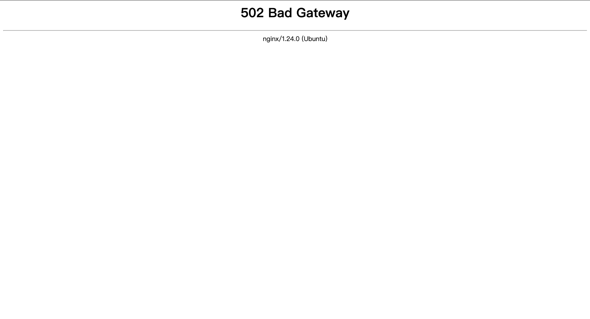

# Database Running
This file is aimed to make a quick introduction about how database running in 2025-RoboSim project.

## Running in local
Please make sure you have download and install **Node.js** and **Docker**.
You need to set up **.env** and **.env.local** file as well.

Make sure you have **started Docker** before next step.

After that, you could run **`npm run start:local`** in your terminal.

Ps: Make sure you run this command in root directory

Then it should set up PostgreSQL database in local and finish migration automatically.

Expect output:

```
Algorithm Client socket server started on port 7071
HTTP server is running on port http://localhost:3000/
PostgreSQL Pool connected successfully.
Populating Scenarios table with default scenarios
```


## Common problems of running in local
There are several problems you might meet:

### Q: Why my terminal has : `unknown shorthand flag: 'f' in -f` 
A : This problem always happen because of version of docker.
You might have the exception like this now: 
```
unknown shorthand flag: 'f' in -f

Usage:  docker [OPTIONS] COMMAND [ARG...]

Run 'docker --help' for more information
```
Basically, your docker compose version is **V1.** Therefore, you need to update it to **V2**.

### Q: Why it shows that `The "PGUSER" variable is not set. Defaulting to a blank string.`
A: You need to check whether you have set up .env and .env.local file or not.
It occurs only when you did not finish setting step.

### Q: Why I have permission problems? 

```
unable to get image 'postgres:16': permission denied while trying to connect to the Docker daemon socket at unix:///var/run/docker.sock: Get "http://%2Fvar%2Frun%2Fdocker.sock/v1.51/images/postgres:16/json": dial unix /var/run/docker.sock: connect: permission denied
```

A: Please make sure you have installed and opened Docker while you use `npm run start:local`.

### Q: Why I have authorization problems?

A: The answer might be you have already set up database in your local before run `npm run start:local`.
Please check if the output is like:
```
Error connecting to PostgreSQL pool: error: password authentication failed for user "robosim"

```
As you have seen, you might use export to force to use username and password.
Therefore, you might need to use:
```
unset PGUSER PGPASSWORD PGDATABASE PGHOST POSTGRES_USER POSTGRES_PASSWORD POSTGRES_DB FLYWAY_USER FLYWAY_PASSWORD

```
to remove export command and run `npm run start:local` again.


## Running algorithm on server
The method to run algorithm on server is as usual. Firstly, you need to find:(for example)
```
  asyncio.run(
        start_client(
            algorithm,
            token="TEST_TOKEN",
            name="A* Client",
            url="ws://localhost:7071",
        )
    )
```
in your code.

Then, you need to change **token** to yours.

Lastly, change **url** stuff:
```
  asyncio.run(
        start_client(
            algorithm,
            token="<your tokens>",
            name="A* Client",
            url="ws://<our public ip address>/ws",
        )
    )
```

## Problem log

### Date: 10/02/26: It used to have EOF problems for Windows system when running bash stuff.

Solution: Try to use `dotenv` to replace `bash` to source env file.

### Date: 16/02/26: Transparent box does not work on server

Solution: `git pull` to get new info of repo, and use 
```
docker compose -f docker-compose.yml -f docker-compose.prod.yml up -d --build
```
to restart.(all operations should work on server)

### 19/02/26 ： Server related to scenario fails due to change a new project structure

Solution : Check the container connected to the correct database instance.
Change the correct path in container for insertion.
As long as the scenarios table is not empty, the default scenarios will not be populated.
If reinitialization is required:
```
TRUNCATE TABLE scenarios RESTART IDENTITY CASCADE;
docker restart robosim-app
```

### 19/02/26 ：Server 502 bad gateway issue


Solution: Check if there is conflict with old container and new container.
Delete old container before create new container, otherwise it will happen port conflict.

