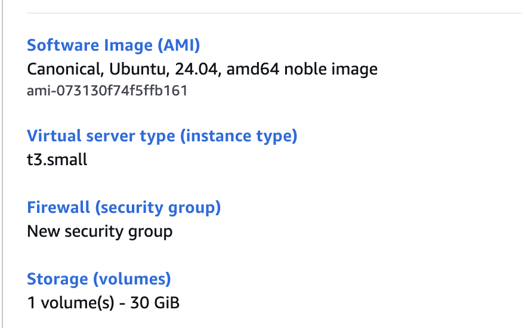
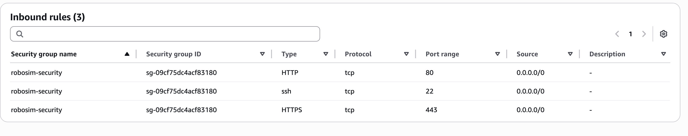

# AWS Server
This file is to analysis current architecture of AWS server which makes this year.
It also includes how to set up AWS server.

## **Difference** between 2025 server and 2024 server
This year we update our database from SQLite to PostgreSQL.
Compared 2024, we need a special container to store our PostgreSQL.
Therefore, we update our server this year.

## Architecture of 2025 server
This is our MVP stage aws server architecture.
```
Internet (Browser / Algorithm Client)
            |
         80/443
            |
         [ Nginx ]  (EC2, Public IP)
            |
      proxy to localhost:3000
            |
      [ Node App ]  (HTTP + WebSocket)
            |
         5432 (only access inner)
            |
      [ Postgres ]  (Docker container or RDS)
```
## Set up EC2 on AWS
PS: if you still use AWS Academy which used in CSA, I strongly recommend you to apply for formal AWS account from our university.

### log in AWS and launch EC2 instance
The type of instance and related info as screenshoot shown below: 


For AMI parts, you can choose whether you want. The only different between Amazon and Ubuntu might only be command in EC2.
For instance type, I consider t3.micro might not be enough. As result, t3.small might be a good choice.
As for security group, the port we need has already shown in architecture.

### Finish basic setting in EC2
Use ssh to login EC2 in your terminal remotely:

`ssh -i ~/.ssh/<yourkey.pem> ubuntu@<YOUR_PUBLIC_IP>`

Updates your system by commands:

```
sudo apt update
sudo apt -y upgrade
```

Download Docker and related files:

Here you can follow the instructions of website below:
https://docs.docker.com/engine/install/ubuntu/?utm_source=chatgpt.com

You could use:
```
docker --version
docker compose version
```
to check whether Docker and related file download successfully or not.

Download Nginx:
```
sudo apt -y install nginx
sudo systemctl enable --now nginx
```

### Clone repo into EC2
Use `git clone` to clone repo in EC2. 
You could create ssh keys in EC2 and add it in your Github account which might be convenient in your further operations.

## Some useful command

### 1.Check if Nginx working : 
`curl -i http://127.0.0.1/ | head`

**expect output** : Have Nginx in Header

### 2.Check if server can be access in your own laptop
`curl -i http://<your public IP>/ | head`

**expect output** :

```
HTTP/1.1 200 OK
Server: nginx/1.24.0 (Ubuntu)
Date: Sat, 31 Jan 2026 13:20:31 GMT
Content-Type: text/html; charset=utf-8
Content-Length: 952
Connection: keep-alive
```

### 3.Docker stuff

**use docker to build image on server:**

`docker compose -f docker-compose.yml -f docker-compose.prod.yml up -d --build`


